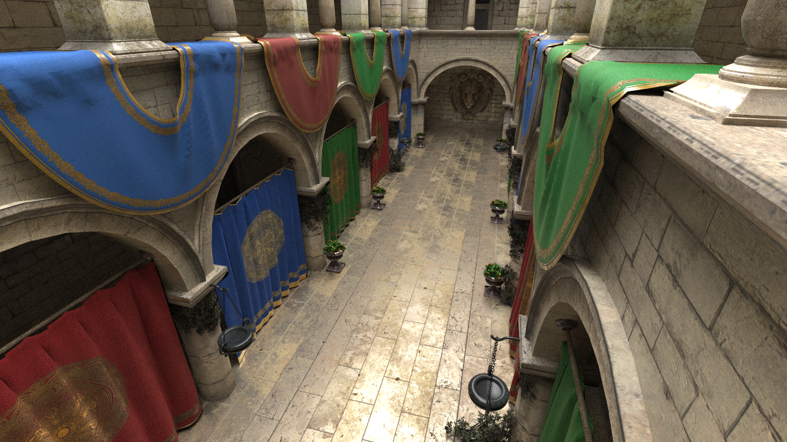
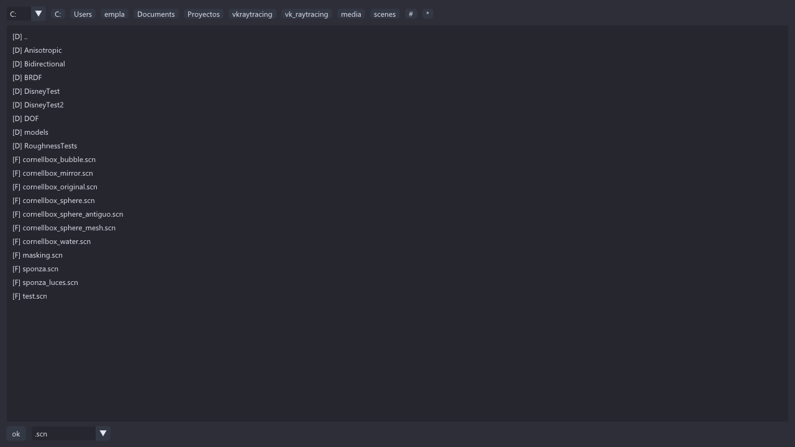
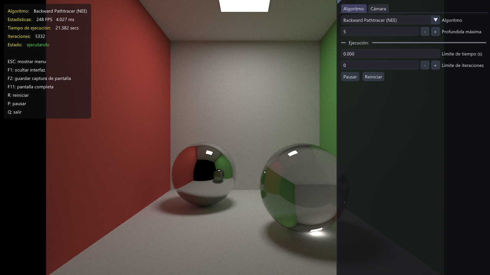

# Vulkan Ray Tracing

El proyecto implementa distintas técnicas de transporte de luz basadas en trazado de rayos, ejecutadas íntegramente en GPU mediante la API Vulkan

- **Path Tracing (PT)**  
  Integrador clásico de trazado de caminos con muestreo Monte Carlo para la simulación global de iluminación.

- **Bidirectional Path Tracing (BDPT)**  
  Técnica bidireccional que construye caminos tanto desde la cámara como desde las fuentes de luz.

- **Multiple Importance Sampling (MIS)**  
  Estrategia de muestreo utilizada para combinar eficientemente distintas técnicas de generación de caminos y reducir la varianza.

- **Next Event Estimation (NEE)**  
  Muestreo explícito de luces directas.

## Capturas

</img>
</img>

## Primeros pasos

### Requisitos

* **Vulkan SDK** (versión 1.2.162.0 o superior): https://vulkan.lunarg.com/sdk/home  
* **CMake** (versión 3.9.6 o superior)  
* **Visual Studio 2022**

### Instalación

Para clonar el repositorio junto con sus submódulos, se recomienda utilizar el siguiente comando:

```bash
git clone --recursive https://github.com/StrikerMF4/vkraytracing.git
```


Para generar la solución de Visual Studio 2022, ejecutar los siguientes comandos:

```bash
cd vk_raytracing
cmake .
```

El ejecutable puede generarse utilizando Visual Studio 2022 o mediante la línea de comandos:

```bash
cmake --build . --config Release
```

o

```bash
cmake --build . --config Debug
```

El ejecutable se encontrará en el directorio ```/bin_x64/Release``` ó ```/bin_x64/Debug``` respectivamente.

### Ejecución

El programa se compila en un ejecutable que permite seleccionar la escena y configurar los parámetros mediante una interfaz gráfica.

</img>
</img>


Adicionalmente, todos los parámetros pueden especificarse por línea de comandos.
Por ejemplo, para ejecutar la escena ```cornellbox.scn``` utilizando la técnica **BDPT**, se puede usar el siguiente comando:

```bash
vk_path_tracer.exe -scene "cornellbox.scn" -technique "bdpt" 
```

El resto de los parámetros disponibles puede consultarse mediante:
```bash
vk_path_tracer.exe --help
```

## Licencia

Este proyecto se distribuye bajo la licencia **Creative Commons Atribución 4.0 (CC BY 4.0)**.
 

## Reconocimientos

* [nvpro-samples](https://github.com/nvpro-samples/vk_mini_samples)
* [glm](https://github.com/g-truc/glm)
* [imgui](https://github.com/ocornut/imgui)
* [tinyexr](https://github.com/syoyo/tinyexr)
* [tinyobjloader](https://github.com/tinyobjloader/tinyobjloader)
* [json-reader](https://github.com/nlohmann/json)
* [tinygltf](https://github.com/syoyo/tinygltf)

